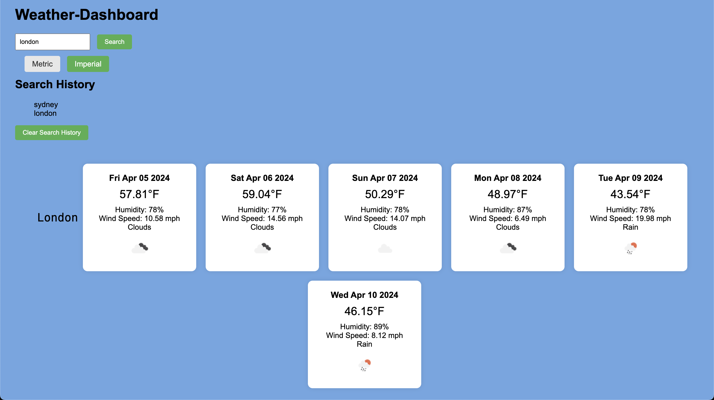

# Weather-Dashboard
* As a developer, I added functionality to show a 5 day forecast.
* As a developer, I added a preferred unit switcher for the weather data.
* As a developer, I added functionality to display search history.
* As a developer, I added functionality to display a forecast when a city from the search history is clicked.

Github URL: https://github.com/Sei-cloud/Weather-Dashboard
Deployed URL: https://sei-cloud.github.io/Weather-Dashboard/
